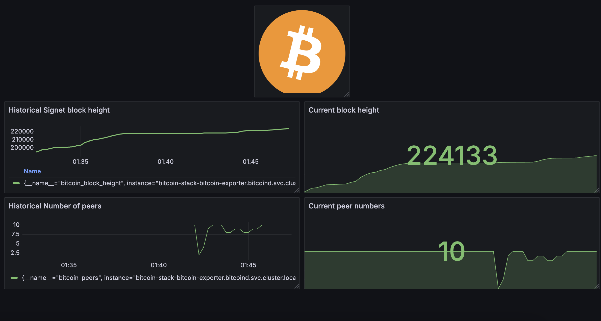

# Bitcoin Node Observer

A Kubernetes-based Bitcoin Signet node with custom metrics exporter and monitoring stack.



## Architecture

The project consists of three main components:
- Bitcoin Signet Node (StatefulSet)
- Custom Bitcoin Metrics Exporter
- Monitoring Stack (Prometheus + Grafana)

## Quick Start

### Prerequisites
- Kubernetes cluster (local or remote)
- Helm 3.x
- kubectl configured
- [k9s](https://k9scli.io/) (optional)

### One-Click Deployment

```bash
cd bitcoin-stack
helm dependency update
helm install bitcoin-stack .
```

For detailed configuration options, see [Bitcoin Stack Documentation](./bitcoin-stack/README.md).

## Component Details

### 1. Bitcoin Node (Signet)
The Bitcoin node runs as a StatefulSet in Kubernetes, ensuring persistent blockchain data and stable networking.

Quick test with Docker:
```bash
docker run --rm -it \
  bitcoin/bitcoin \
  -p 38332:38332 \
  -p 38333:38333 \
  -printtoconsole \
  -signet=1 \
  -rpcallowip=0.0.0.0/0 \
  -rpcbind=0.0.0.0 \
  -rpcuser=foo \
  -rpcpassword=bar \
  -rpcport=38332
```

For detailed node configuration, see [Bitcoin Node Documentation](./bitcoind/README.md).

### 2. Bitcoin Metrics Exporter
Custom Prometheus exporter that collects Bitcoin node metrics via RPC.

Features:
- Block height monitoring
- Peer connection statistics
- RPC health checks

For build instructions and configuration, see [Exporter Documentation](./bitcoin-exporter/README.md).

### 3. Monitoring Stack
Includes:
- Prometheus for metrics collection
- Grafana for visualization
- Pre-configured dashboards

Access the dashboards:
- Grafana: http://grafana.local
- Prometheus: http://prometheus.local
- BTC exporter: http://btc-exporter.local

## Project Structure
```
.
├── bitcoin-exporter/     # Custom Prometheus exporter
├── bitcoin-stack/        # Umbrella Helm chart
├── bitcoind/            # Bitcoin node Helm chart
└── dashboards/          # Grafana dashboards
```

## Contributing
Feel free to open issues or submit pull requests.

## License
This project is licensed under the MIT License - see the [LICENSE](LICENSE) file for details.
